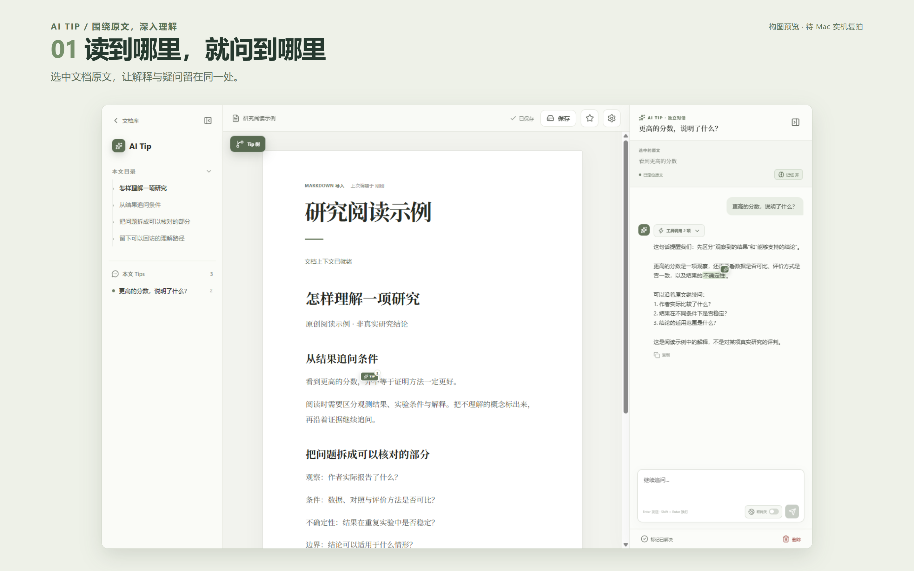
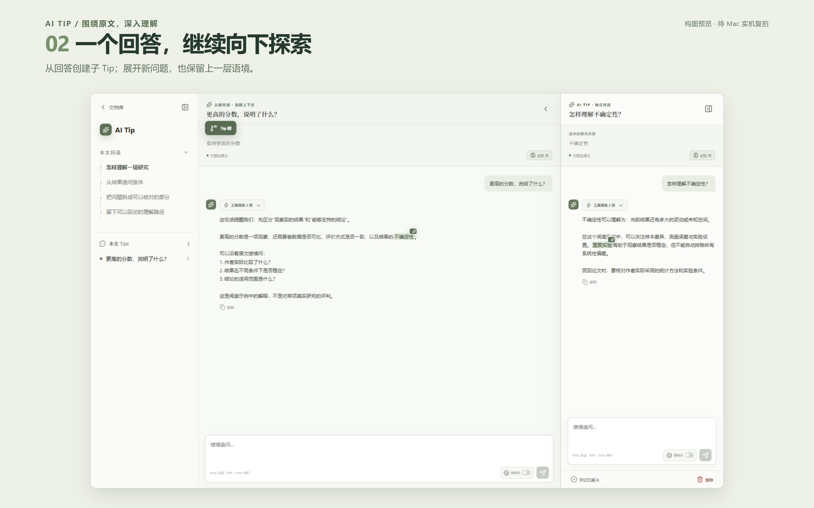
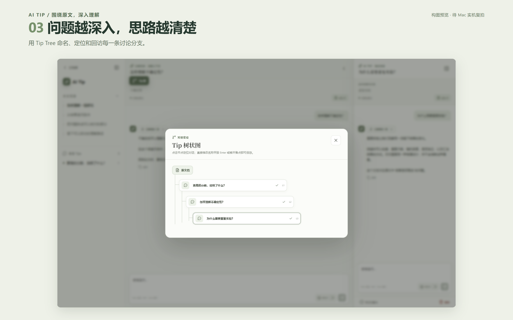
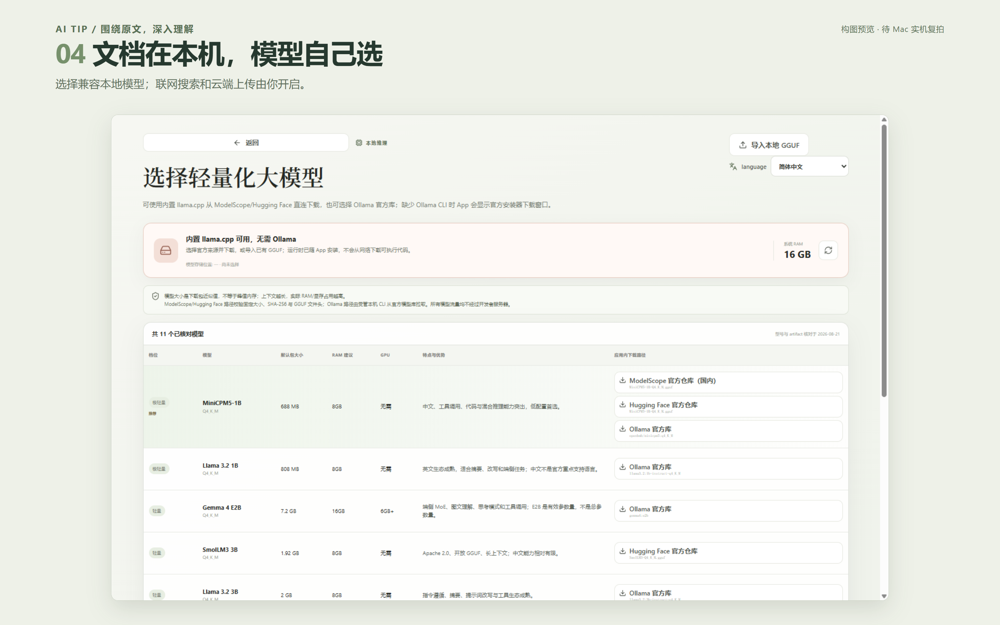
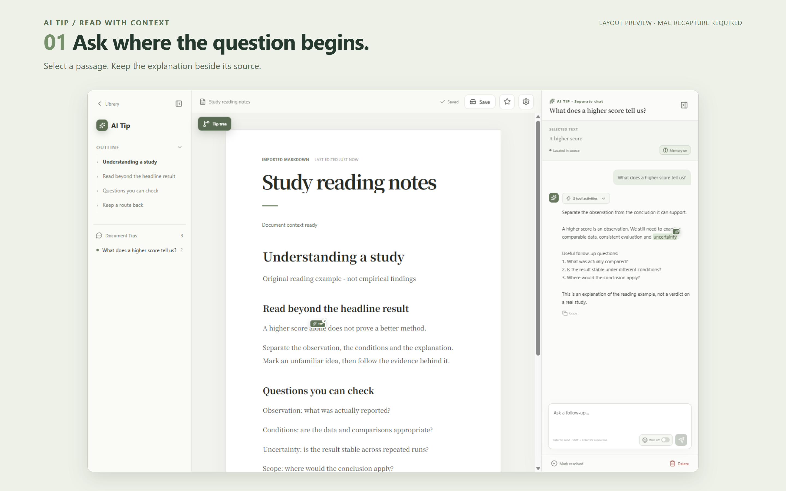
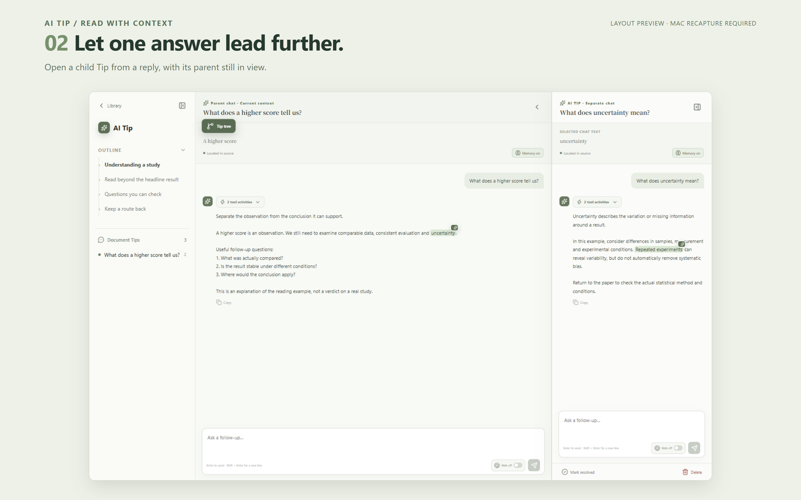
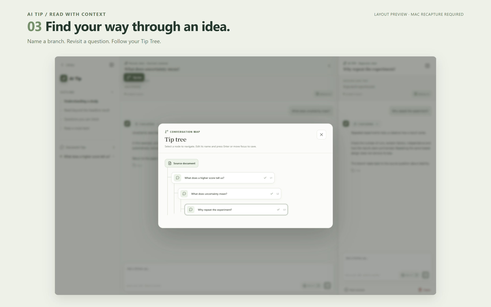
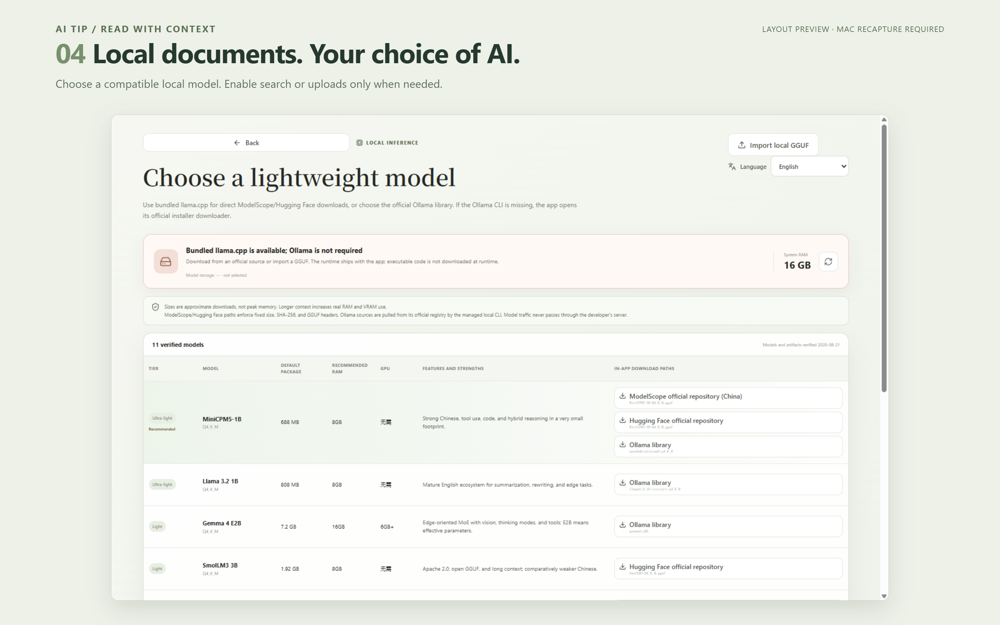

# AI Tip 商店文案与图册

**当前状态：GitHub 展示 / 商店构图草稿，不可直接作为 Mac 提交图。** 当前原始截图来自 Windows 真实客户端，示例回答由受控本机服务返回；没有伪造 UI、模型性能测试或 Mac 签名证据。标题图均包含“待 Mac 实机复拍”标识。

## 中文图册






## English gallery






## 字段和来源

- [metadata.json](metadata.json)：中英文名称、副标题、描述、推广文字、关键词和图片标题。
- [text](text)：App Store Connect 可粘贴的纯文本；模板中不混入公开审核凭据。
- [raw](raw)：8 张未做像素修饰的实际客户端捕获，1440×900。
- [showcase](showcase)：在原始截图外通过 HTML/CSS 添加标题的 8 张构图，2880×1800；未添加假 Mac 窗框。
- [samples](samples)：原创示例 PDF，不是真实研究结果。示例无私人文档、付费论文、Key 或真实账号。
- [capture-manifest.json](capture-manifest.json) / [showcase-manifest.json](showcase-manifest.json)：捕获平台、时间、源码/构建哈希、原图与成图哈希。工作区实拍不等于该 sourceCommit 已包含所有本机改动。
- `macos/zh-CN` 是旧的历史截图，含工程测试文本，不再用于首页和新版图册；目录名不证明平台来源，保留供追溯，不作为提交素材。

## 复现

先 `pnpm desktop:prepare`。最终图片使用捕获脚本内的中英文 Markdown 原创阅读示例，展示可编辑文档的锚定路线。示例 PDF 随仓库保留用于复现与后续复拍；重新生成时，用已安装 reportlab、pypdf 的 Python 执行 `scripts/generate-store-reading-samples.py`。字体默认 Windows 微软雅黑，可用 `AI_TIP_SAMPLE_FONT` 指定有合法使用权且含中文字形的字体。

执行 `pnpm exec electron scripts/capture-store-showcase.mjs`，在临时本机数据目录通过正式导入、Tip/子 Tip 和聊天 API 生成实际界面；不会访问 Supabase 或真实外部模型，也不会下载模型。

标题图执行 `node scripts/render-store-showcase.mjs`。需要开发环境中的 Playwright 与 Chromium；`AI_TIP_PLAYWRIGHT_MODULE` 可指定本地 Playwright ESM 路径，`AI_TIP_BROWSER_EXECUTABLE` 可指定 Chrome/Edge 可执行文件。脚本仅渲染本地文字和原始截图，不联网。此工具不是应用运行时依赖。

验证命令：

```sh
node scripts/test-store-metadata.mjs
node scripts/test-store-assets.mjs
node scripts/test-release-readiness.mjs
node scripts/test-store-assets.mjs --submission
```

最后一条是**正式提交阻断检查**，本轮草稿必须失败。尺寸合规和图片存在只属于 COMPONENT_CAPABILITY。Mac 提交需要真实 macOS 签名候选包、功能验证、实际模型回答、人工隐私检查和新的来源清单；不允许手改 `submissionReady` 掩盖缺失证据。

视觉复核注意：PDF 在窗口宽度变化后出现选区高亮偏移，后续英文材料也复现，尚未确定根因。最终阅读展示稿使用可编辑文档路径，不将有偏移的 PDF 画面作为首图，PDF 样例保留供复现。英文模型目录的 GPU 字段仍出现“无需”，属于已有翻译遗漏。本次不修补业务代码，不手工移动高亮或改图片中的文字来掩盖问题；两项均须在正式截图前修复并复拍。

Mac 图片规格依据：[Apple 截图规格](https://developer.apple.com/help/app-store-connect/reference/app-information/screenshot-specifications)。视频可选，见 [预览分镜](preview-storyboard.md)。
